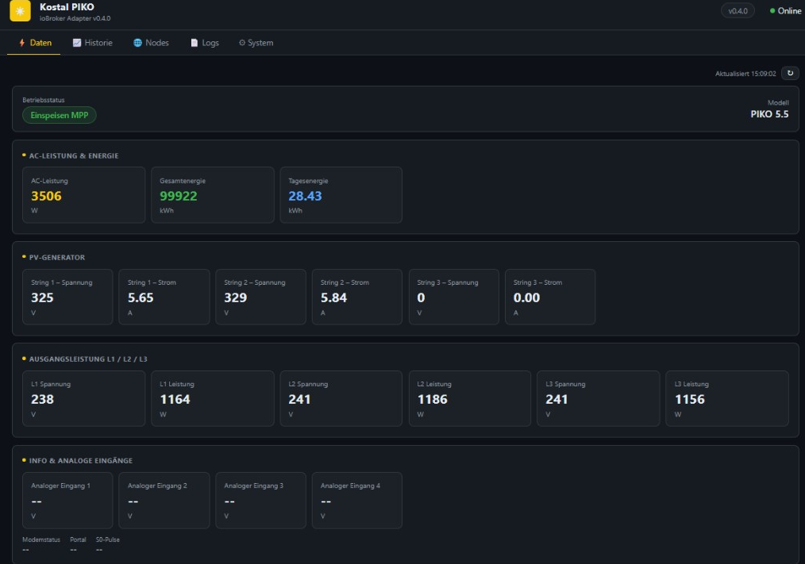
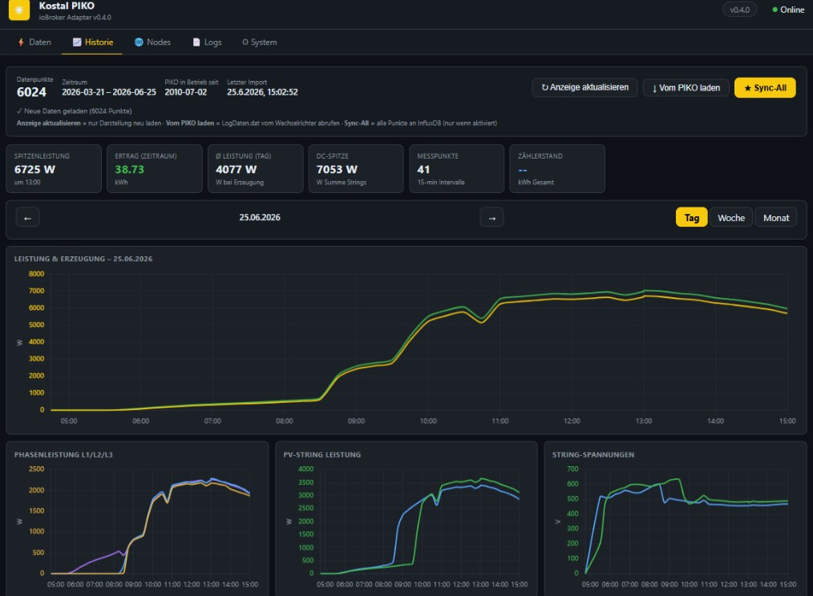
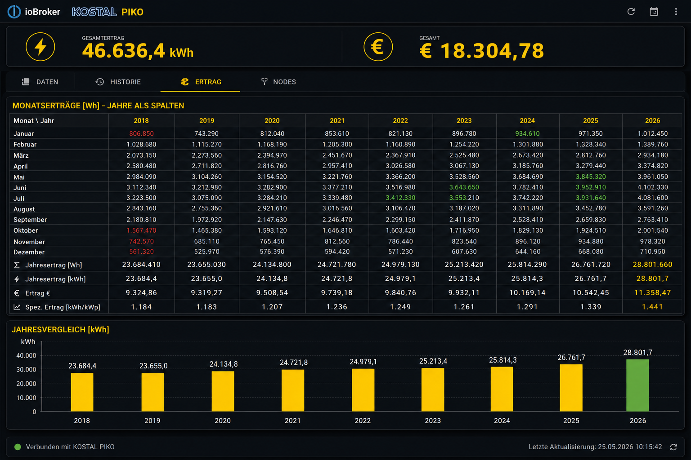
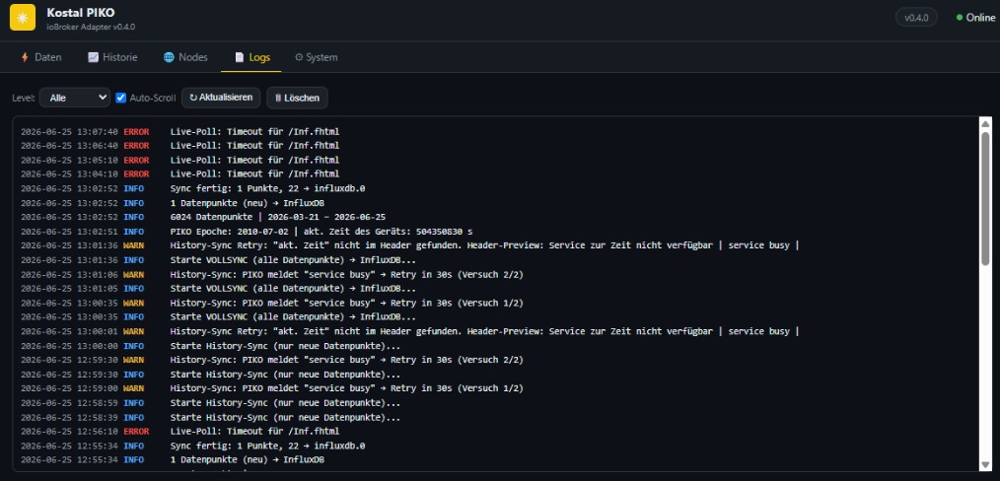
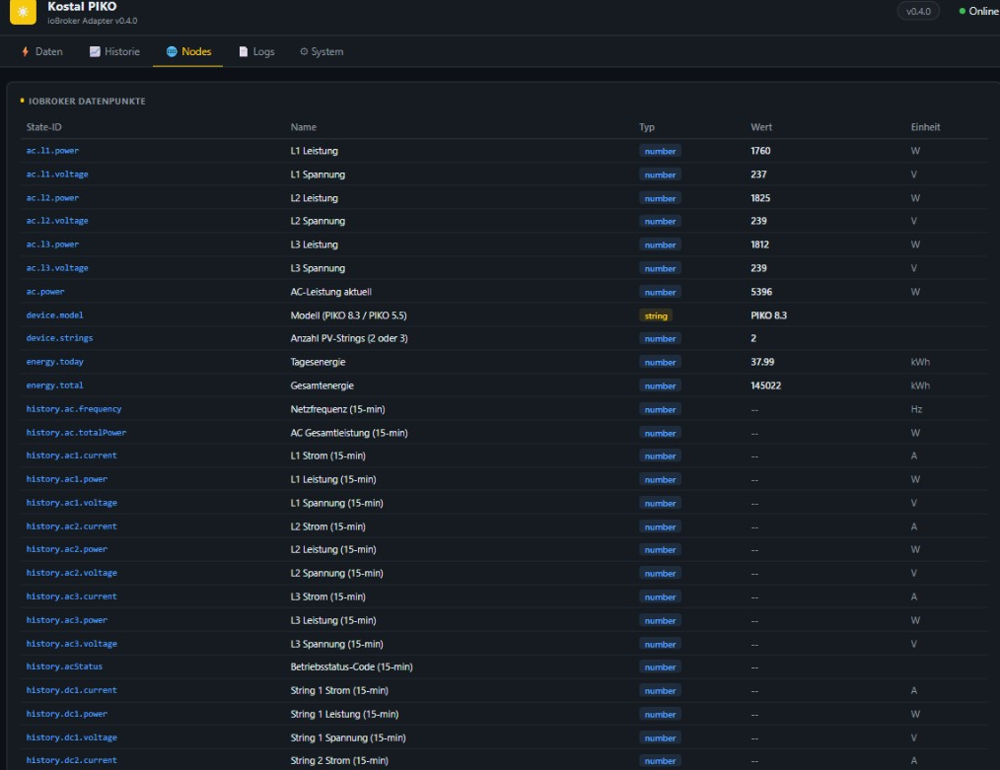
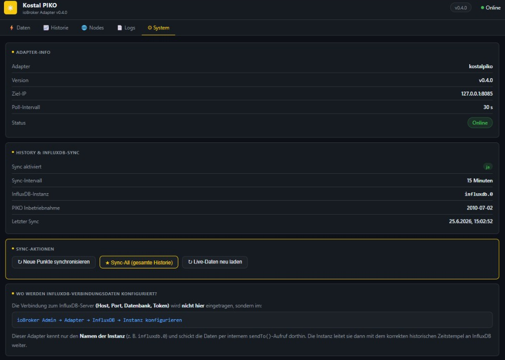

# ioBroker Kostal PIKO Adapter

[](https://github.com/MPunktBPunkt/iobroker.kostalpiko/releases)
[](./LICENSE)
[](https://www.paypal.com/donate/?business=martin%40bchmnn.de&currency_code=EUR)
[](https://nodejs.org)

**Live-Monitoring, 15-Minuten-Historie und Langzeit-Ertrag** für Kostal PIKO-Wechselrichter – direkt über den eingebauten HTTP-Webserver, ohne Portal-Zwang.  
Messwerte als ioBroker-Datenpunkte, optionale **InfluxDB**-Anbindung für Grafana, eingebautes **Engineer-Dashboard** im Browser.

```
http://IOBROKER-IP:8092/     ← kostalpiko.0
http://IOBROKER-IP:8093/     ← kostalpiko.1 (weitere Instanzen +1 Port)
```

---

## Dashboard im Überblick

| Tab | Was du siehst |
|---|---|
| ⚡ **Daten** | Live AC/DC, Phasen, Wirkungsgrad, String-Werte, **Vmpp-Temperatur**, Wetter (unten) |
| 📈 **Historie** | KPIs, Chart.js-Kurven, 15-min-Tabelle, String-Analyse, **Temperaturverlauf** |
| 📊 **Ertrag** | Monatstabelle Jahre × Monate, €/kWh, Export/Import, Jahresvergleich |
| 🌐 **Nodes** | Alle ioBroker-States der Instanz |
| 📄 **Logs** | Adapter-Log (Sync, PIKO-Abruf, Fehler) |
| ⚙️ **System** | Verbindung, InfluxDB, manueller Sync |

---

## Screenshots

### ⚡ Daten – Live vom Wechselrichter

AC-Leistung, Tages- und Gesamtenergie, DC-Summe und Wirkungsgrad – alle 30 Sekunden aktualisiert.



PV-Strings mit Spannung und Strom pro String (2 oder 3 Strings je nach PIKO-Modell). Wetter & Sonne erscheint **unterhalb** der PV-Daten.


---

### 📈 Historie – 15-Minuten-Archiv

Rohdaten aus `LogDaten.dat` (~6 Monate), lokal gecacht. Tag/Woche/Monat umschaltbar, KPI-Leiste mit Spitzenleistung und Tagesertrag.


Interaktive Kurven: AC/DC-Leistung, Phasen, String-Leistung und MPP-Spannungen. Abends Nachhol-Sync, wenn die Tageskurve hängen bleibt.



Messwert-Tabelle mit allen Spalten (filterbar nach gewähltem Zeitraum).


---

### 📊 Ertrag – Langzeitauswertung

Ersatz für die Excel-Monatstabelle – persistent in `iobroker-data/kostalpiko.N/monthly-yields.json`.


Toolbar mit Cache-Berechnung, Backup (`.bak`), Import/Export und Vergütungs-Einstellungen. **Blaue Zellen** = manuell, **weiße** = aus History-Cache.



| Funktion | Beschreibung |
|---|---|
| **Aus Cache** | Monate aus `history-cache.json` berechnen (nicht direkt vom PIKO) |
| **Backup** | `monthly-yields.json.bak` wiederherstellen |
| **+ Jahr / Jahre auffüllen** | Leere Jahres-Spalten anlegen |
| **Manuell** | Zelle anklicken → Wh eintragen; dein Wert hat immer Vorrang |
| **Vom PIKO laden** | Auf dem **Historie-Tab** – holt frische `LogDaten.dat` |

Beide Wechselrichter kombinieren:

```bash
node /opt/iobroker/node_modules/iobroker.kostalpiko/scripts/combine-yields.js \
  /opt/iobroker/iobroker-data kostalpiko.0 kostalpiko.1 --from 2018-05 --csv ertrag.csv
```

---

### 📄 Logs & System

Sync-Status, PIKO-Abrufe und Warnungen auf einen Blick.



<details>
<summary>Weitere Tabs (Nodes, System)</summary>





</details>

> Screenshots aktualisieren: siehe [docs/screenshots/README.md](docs/screenshots/README.md)

---

## Features

| Bereich | Funktion |
|---|---|
| **Live-Daten** | AC/DC, Phasen, Energie, Status, Wirkungsgrad |
| **Historie** | LogDaten.dat, Chart.js, Cache, Nachhol-Abruf |
| **Ertrag** | Jahre × Monate, manuell + auto, €, kWh/kWp, CSV/JSON |
| **Wetter** | Open-Meteo: Sonnenstunden, Bewölkung, Temperatur (PLZ) |
| **Analyse** | String-Analyse, Kostal-Datenblatt-Grenzwerte |
| **InfluxDB** | Live + History mit historischem Zeitstempel |
| **Multi-Instanz** | `kostalpiko.0` + `kostalpiko.1` parallel |
| **Benachrichtigungen** | Tages-/Wochen-/Monatsberichte (E-Mail, Telegram, Pushover) |

---

## Getestete Hardware

| Modell | Strings | Status |
|---|---|---|
| PIKO 3.0 – 4.2 | 1–2 | Unterstützt |
| PIKO 5.5 | 3 | ✅ Getestet |
| PIKO 7.0 – 8.3 | 2 | ✅ Getestet (8.3) |
| PIKO 10.1 | 3 | Unterstützt |

Firmware: ver 3.62 · Modell in den Einstellungen wählbar oder Auto-Erkennung.

---

## Installation & Update

```bash
iobroker url https://github.com/MPunktBPunkt/iobroker.kostalpiko
iobroker add kostalpiko          # nur bei Erstinstallation
iobroker update kostalpiko
iobroker restart kostalpiko
```

**Releases:** [github.com/MPunktBPunkt/iobroker.kostalpiko/releases](https://github.com/MPunktBPunkt/iobroker.kostalpiko/releases)

Details: [INSTALLATION.md](./INSTALLATION.md) · [Schnittstellen.md](./Schnittstellen.md)

---

## Konfiguration (Auszug)

| Einstellung | Standard | Beschreibung |
|---|---|---|
| IP / Port / Auth | – | PIKO-Webserver |
| Poll-Intervall | 30 s | Live-Abfrage |
| Historiendaten laden | aus | `LogDaten.dat` |
| Sync-Intervall | 15 min | History + optional InfluxDB |
| Web-UI Port | 8092 | pro Instanz +1 |
| Postleitzahl | 87781 | Wetter + regionaler Vergleich |
| Einspeisevergütung | 0,3925 €/kWh | Ertrag-Tab |
| Modul-Konfiguration | optional | String-Analyse, kWp |

InfluxDB (Host, Token, DB) wird im **InfluxDB-Adapter** konfiguriert.

---

## Datenpunkte (Auswahl)

**Live:** `ac.power`, `energy.today/total`, `pv.string1/2/3.*`, `dc.totalPower`, `efficiency.ratio`, `weather.*`, `status`, `online`

**History (15-min):** `history.dc1/2/3.*`, `history.ac.*`, `history.ac.totalPower`, `history.energy.total`, `history.efficiency.ratio`

Vollständige Liste: Web-UI → Tab **Nodes** oder [Schnittstellen.md](./Schnittstellen.md)

---

## Mehrere Wechselrichter

| Instanz | Web-UI | Daten |
|---|---|---|
| `kostalpiko.0` | :8092 | eigene `monthly-yields.json`, `history-cache.json` |
| `kostalpiko.1` | :8093 | eigene Dateien |

---

## InfluxDB & Grafana

| Quelle | Zeitraum |
|---|---|
| History-Cache | ~6 Monate (wächst mit Merge) |
| InfluxDB nach Sync | unbegrenzt* |

\*Sofern keine kürzere Retention gesetzt wird.

Empfehlung: einmal **Sync-All** pro WR, danach automatischer 15-min-Sync.

---

## Changelog


### **WORK IN PROGRESS**
- (ioBroker-Bot) Adapter requires js-controller >= 6.0.11 now.

### v0.6.15
- Fix PIKO 5.5: kühle Module (MPP ≥ 97 %) werden nicht mehr als ungültig verworfen — Temperatur auch bei T &lt; T<sub>Luft</sub>

### v0.6.14
- Temperatur-Kacheln: °C immer anzeigen (absolut / eingeschränkt / ungültig)
- ΔT String 1↔2 ab 50 W Stringleistung
- Historie-Chart filtert Low-G-Ausreißer

### v0.6.13
- **Vmpp-basierte Modultemperatur** pro String (ioBroker-States, Daten-Tab, Historie-Chart)
- Temperaturverlust, MPP-Ausnutzung, System-ΔT
- Konzept: [`docs/KonzeptPikoTemperatur.md`](docs/KonzeptPikoTemperatur.md)

**[GitHub Releases](https://github.com/MPunktBPunkt/iobroker.kostalpiko/releases)**

---

## Spende

[](https://www.paypal.com/donate/?business=martin%40bchmnn.de&currency_code=EUR)

---

## Lizenz

**GNU General Public License v3.0** – [LICENSE](./LICENSE)  
© 2026 MPunktBPunkt
